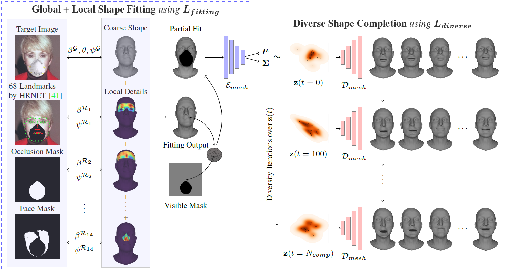
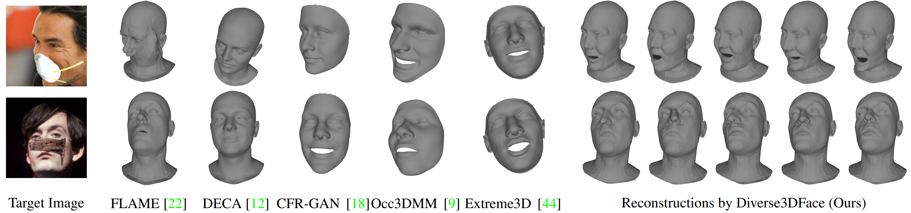

# Generating Diverse 3D Reconstructions from a Single Occluded Face Image [[video]](https://www.youtube.com/watch?v=yb7j00pX-Ds) [[arXiv]](https://arxiv.org/abs/2112.00879)

```BibTex
@inproceedings{dey2022generating,
  title={Generating Diverse 3D Reconstructions from a Single Occluded Face Image},
  author={Dey, Rahul and Boddeti, Vishnu Naresh},
  booktitle={Proceedings of the IEEE/CVF Conference on Computer Vision and Pattern Recognition},
  pages={1547--1557},
  year={2022}
}
```

## Overview



Occlusions are a common occurrence in unconstrained face images. Single image 3D reconstruction from such face images often suffers from corruption due to the presence of occlusions. Furthermore, while a plurality of 3D reconstructions is plausible in the occluded regions, existing approaches are limited to generating only a single solution. To address both of these challenges, we present Diverse3DFace, which is specifically designed to simultaneously generate a diverse and realistic set of 3D reconstructions from a single occluded face image. It consists of three components: a global+local shape fitting process, a graph neural network-based mesh VAE, and a Determinantal Point Process based diversity promoting iterative optimization procedure. Quantitative and qualitative comparisons of 3D reconstruction on occluded faces show that Diverse3DFace can estimate 3D shapes that are consistent with the visible regions in the target image while exhibiting high, yet realistic, levels of diversity on the occluded regions. On face images occluded by masks, glasses, and other random objects, Diverse3DFace generates a distribution of 3D shapes having ~50% higher diversity on the occluded regions compared to the baselines. Moreover, our closest sample to the ground truth has ~40% lower MSE than the singular reconstructions by existing approaches.

## Sample Results



## Setup
- Create a new python environment by running the following command using conda:
```bash
cd diverse3dface
conda env create -f env.yml
```

- Download data.zip from this [[link]](https://drive.google.com/file/d/1ki8Y3hMy9AL3F_dovLgtViT_dRhdU2fj/view?usp=sharing) and unzip in the diverse3dface directory (as diverse3dface/data)

- Create a directory named pretrained_models and download the pretrained models from this [[link]](https://drive.google.com/drive/folders/147SVY71dRsNX3sasFq1RIUpGpHP7GuXU?usp=sharing) into that folder.

## Inference
Run the inference code as:
(a) If occlusion-mask available:
```python
python inference.py <path/to/target/image> <path/to/occlusion/mask> <config_file> <output_folder>
```
Example:
```python
python inference.py examples/1.jpg examples/1-seg_mask.png config_test.config results
```

(b) If occlusion-mask is not available:
```python
python inference.py <path/to/target/image> <config_file> <output_folder>
```
Example:
```python
python inference.py examples/3.jpg config_test.config results
```

The output meshes would be generated in the results/<image_name> folder in the .ply format
